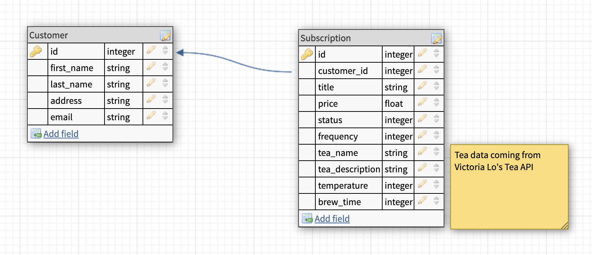

# Tea Backend API
The Tea BE API is an application that consumes Victoria Lo's [Tea API](https://github.com/victoria-lo/TAPI), and exposes customer and subscription data for a notional Frontend to consume.

## Architecture

This app was built using a service-oriented architecture. This repo is responsible for exposing data for the frontend to consume and display to end users. This repo consumed Victoria Lo's Tea API data via a service-facade-poro paradigm that abstracts these functions out of the controller.

## Schema


The basic design for this app includes two tables. The Subscriptions table consumes the Tea API data from Victoria Lo's endpoint.

## Tools Used:


Rails 5.2.6, Ruby 2.7.2, RSpec, Faraday

## Testing
This repo uses RSpec, Capybara, and Shouldamatchers to fully test the functionality. Each element is tested, and coverage is at 100%. The request testing also includes sad-path and edge-case testing. Additionally, mocks and stubs are used instead of calling Victoria Lo's Tea API for each test, and factories are used to create the test data for customers and subscriptions.

## Setup

* From the command line, install gems and set up your DB:
  * `bundle`
  * `rails db:{drop,create,migrate}`
* Run test suite with `bundle exec rspec`
* Run your development server with `rails s` to see the endpoints in action!
  * Note: Be sure that your URI starts with `/api/v1/`

## Endpoints
- Get all subscriptions for a customer
   *  GET `/api/v1/customers/:customer_id/subscriptions`

   Example response:
     ```
     {
    "data": [
        {
            "id": "1",
            "type": "subscriptions",
            "attributes": {
                "title": "Green Tea",
                "price": 2.5,
                "status": "active",
                "frequency": 1,
                "customer_id": 1,
                "tea_name": "green",
                "tea_description": "wakes you up",
                "brew_time": 2,
                "temperature": 95
            }
        },
        {
            "id": "2",
            "type": "subscriptions",
            "attributes": {
                "title": "Black Tea",
                "price": 3.0,
                "status": "cancelled",
                "frequency": 2,
                "customer_id": 1,
                "tea_name": "black",
                "tea_description": "smooth and subtle",
                "brew_time": 3,
                "temperature": 100
            }
        }
    ]
}
  ```

  For the following two endpoints, the tea name must be passed as a param into the URI so that it can consume Victoria Lo's Tea API data. A list of tea names can be found here: .
  
- Creates a new subscription
  * POST `/api/v1/customers/:customer_id/subscriptions?=#{tea_name}`

- Updates an existing request
  * PATCH `/api/v1/customers/:customer_id/subscriptions/:subscription_id?=#{tea_name}`
